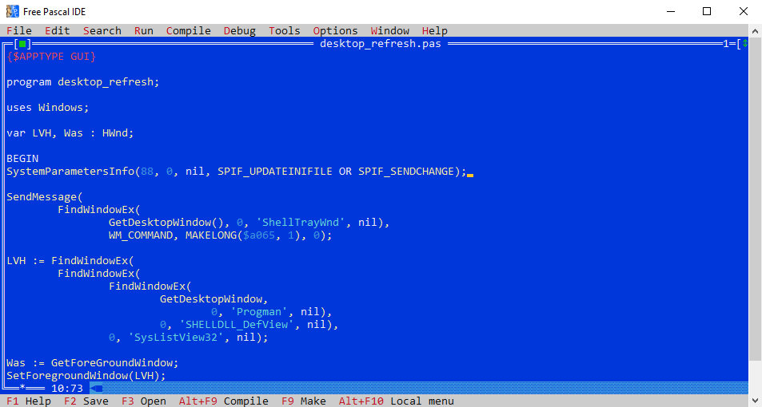

# desktop_refresh
Does what it says on the tin. Windows XP thru 10.

## Usage

It just runs, refreshes desktop and quits.

## Build

Use Free Pascal if to compile from source.
 - https://www.freepascal.org/download.var

## License

Copyright Paul Taylor (c) 2003

See LICENSE file
